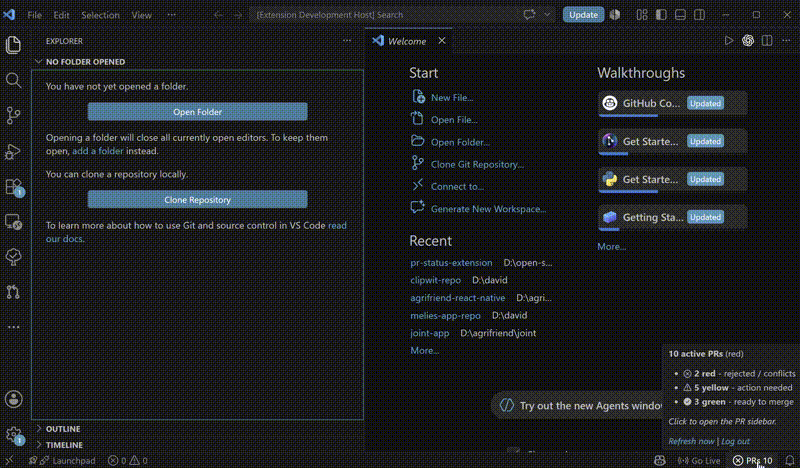
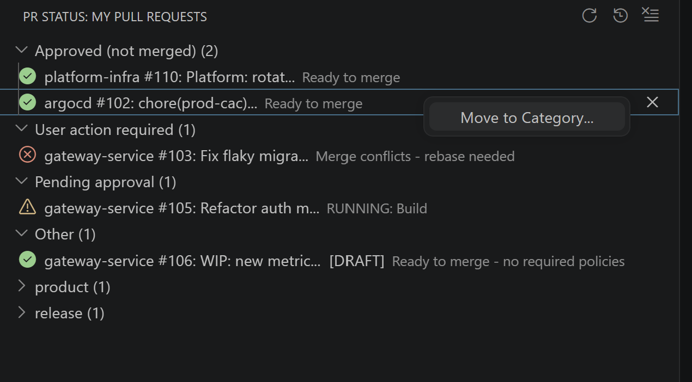
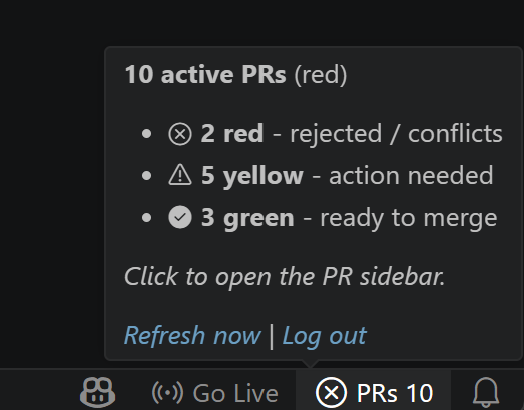

# ADO PR Status Tracker

Track all your Azure DevOps pull requests from inside VS Code, with a live footer signal and a focused sidebar view.

If you review or maintain multiple PRs daily, this extension helps you spot what needs attention without context-switching to the browser.



## Why This Extension

- Instant PR health in the footer (green/yellow/red)
- Sidebar grouped by meaningful workflow categories
- One click to open any PR in browser
- Dismiss noisy PRs until the next push
- Works across organizations with auto-discovery after sign-in

## What You See in VS Code

### PR Sidebar



### Footer Status + Quick Actions



## Color Meaning

- Green: all active PRs are in a healthy state
- Yellow: pending review or action needed
- Red: conflict, rejection, or blocker detected

## Quick Start

1. Install the extension from the Marketplace.
2. Open the command palette and run `PR Status: Sign In to Azure DevOps`.
3. Click the `PRs` footer item to open the sidebar.
4. Use `PR Status: Refresh Now` whenever you want an immediate update.

## Features

- Footer indicator with aggregate health at a glance
- Sidebar sections such as:
  - User action required
  - Pending approval
  - Approved (not merged)
  - Other
- Open PR in browser from the list
- Dismiss PR until next push (auto-undismisses when commits change)
- Optional manual category overrides

## Configuration

| Setting | Default | Description |
|---|---|---|
| `prStatus.organization` | `""` | Optional org slug or URL. Leave empty to auto-discover after sign-in. |
| `prStatus.mockMode` | `false` | Uses sample data for local testing without Azure DevOps access. |

## Commands

- `PR Status: Show My PRs (Quick List)`
- `PR Status: Open PR Sidebar`
- `PR Status: Refresh Now`
- `PR Status: Sign In to Azure DevOps`
- `PR Status: Log Out of Azure DevOps`
- `PR Status: Undismiss a PR...`
- `PR Status: Undismiss All PRs`

## Local Development

```bash
npm install
npm run build
npm test
```

Press `F5` to launch an Extension Development Host.

## Package

```bash
npm run package
```
